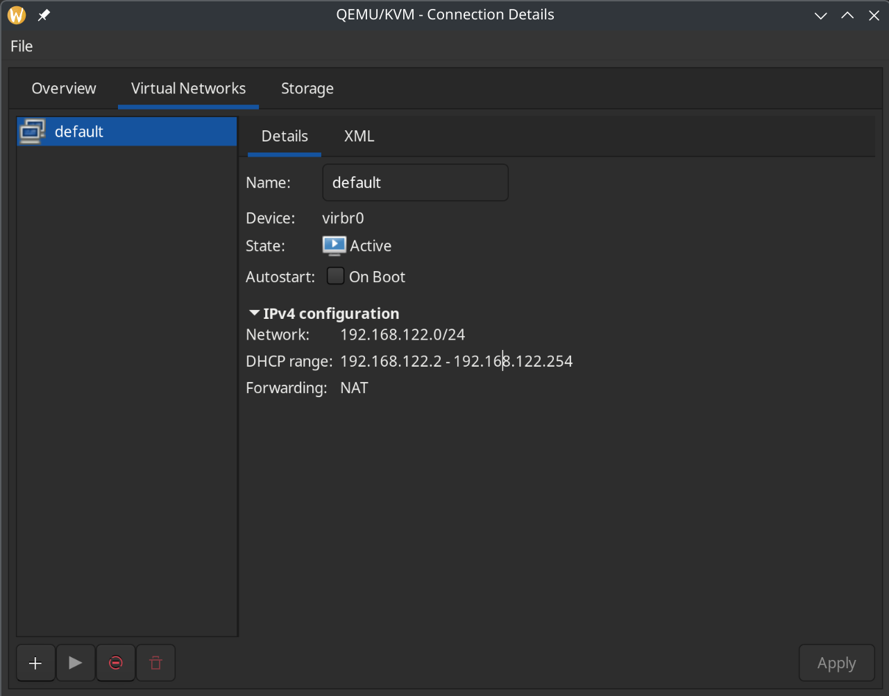
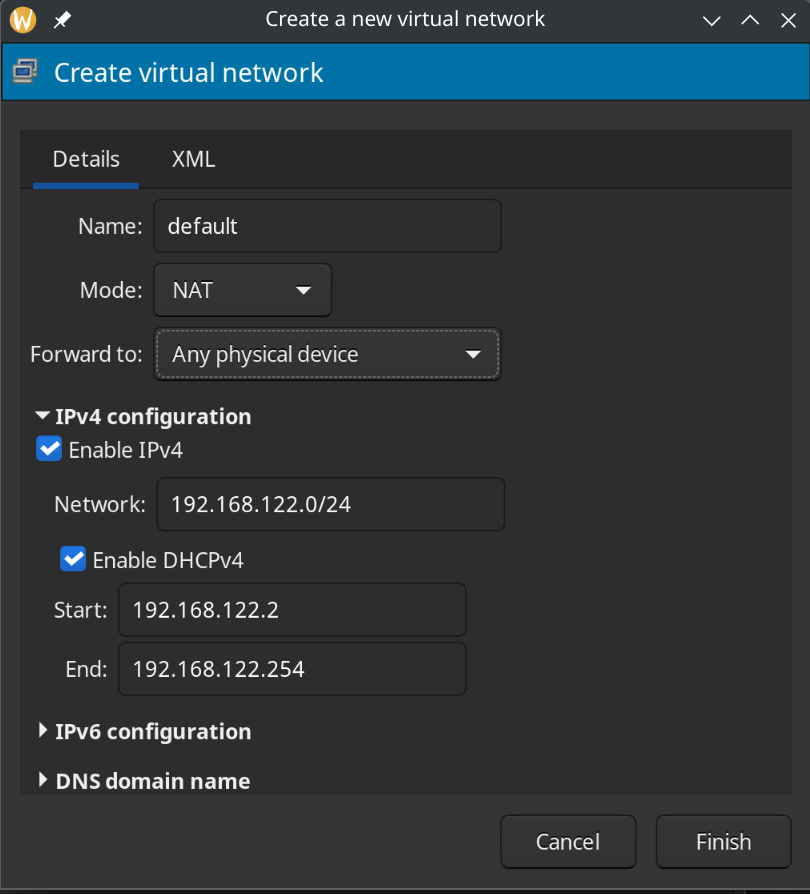
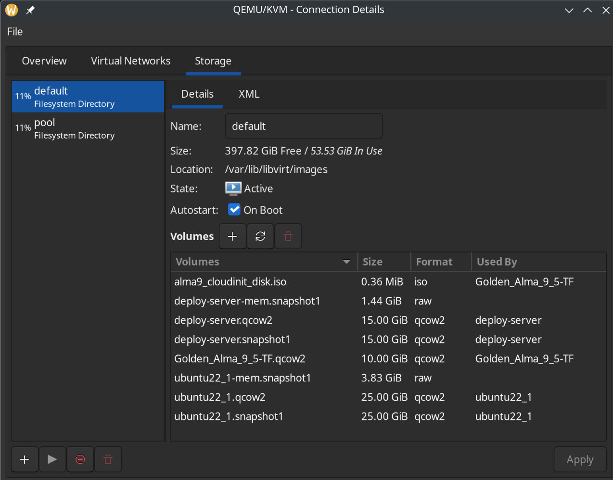
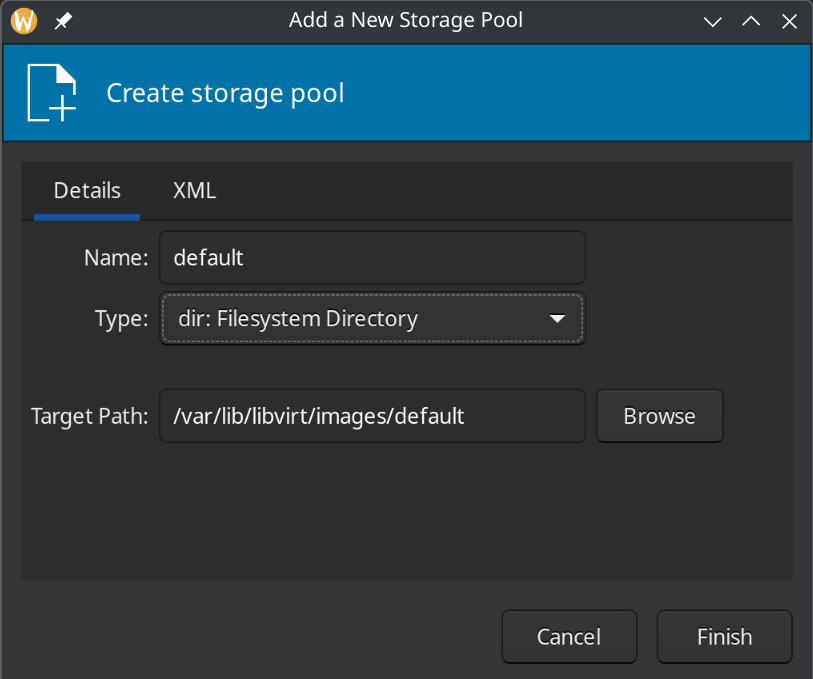

# Тестовое задние DevOps

## Развертывание сервиса

### Зависимости

| Название | Версия |
|----------|--------|
| terraform | 1.12.0 |
| libvirt | 0.8.1|

### Providers

| Name | Version |
|------|---------|
| libvirt | 0.8.1 |
| template | n/a |

### Вариант 1. Запуск сервиса через systemd

1. Запустить VM

Для ВМ я использовал гипервизор QEMU/KVM с ОС AlmaLinux9(образ для облака, с поддержкой cloud-init)

Для запуска ВМ, используется Terraform c провайдером libvirt

Перед запуском Terraform следует убедиться, что существуют сети и пулы нужные для работы ВМ, и создать если их нет. Это можно сделать самостоятельно через Virtual Machine Manager или через терминал с помощью virsh.

Для VMM:

edit -> connection details -> virtual networks

Тут должна присутсвовать сеть default с прописанным DHCP range, и Frowarding NAT, и state active(если нет просто запустите сеть)



если сети нет нужно её создать нажав +



edit -> connection details -> Storage

Здесь должен находится default Filesystem directory в активном состоянии



Если нет, также создаем его нажав +




Для virsh:

Чтобы проверить есть ли сеть default c virsh

```sh
    virsh -c qemu:///system net-list --all
```

если сети default нет её можно создать и запустить командами

```sh
    virsh -c qemu:///system net-define {project_root}/default.xml
    virsh -c qemu:///system net-start default || true
```

Также проверим storage pool:

```sh
    virsh -c qemu:///system pool-list --all
```

Если пула default нет, создаём и запускаем:

```sh
    virsh -c qemu:///system pool-define-as default dir --target /var/lib/libvirt/images
    virsh -c qemu:///system pool-start default
```

2. Создание VM с Terraform

Основана на данном Terroform конфиге из https://github.com/omerfsen/terraform-almalinux-libvirt

Перед созданием ВМ необходимо создать ssh ключи командой
```sh
    ssh-keygen
```
и следовать инструкции


```sh
    cd terraform
    terraform init
    terraform apply -auto-approve -var="ssh_public_key_path=~/.ssh/my_key.pub" -var="ssh_private_key_path=~/.ssh/my_key"
    terraform output -raw ansible_inventory > ../ansible/inventory.ini
```
При возникающих промптах при выполнении команд terraform init и terraform apply просто нажать Enter

После выполнения команд VM будет создана, и Terraform выведет её IP-адрес.

3. Конфигурация и деплой через Ansible

Далее используем Ansible для раскатки микросервиса на только что созданную VM.

Обновляем inventory.ini, подставляя IP вашей VM и запускаем playbook.

```sh
    cd ../ansible
    ansible-playbook -i inventory.ini site.yml
```

После выполнения сервис будет развернут как systemd unit и будет доступен на порту 8080.

Получить доступ с хоста к нему можно по адрессу http://{VM_IP}:8080

-----------------------------------

### Вариант 2. Запуск сервиса через docker

1. Как и в первом варианте(см. выше) запускаем ВМ

2. Конфигурация и деплой через Ansible

Далее используем Ansible для раскатки микросервиса на только что созданную VM.

Обновляем inventory.ini, подставляя IP вашей VM и запускаем playbook.

```sh
    cd ../ansible
    ansible-playbook -i inventory.ini site.yml -e "deploy_method=container"
```

После выполнения образ сервиса будет собран и запущен. Он будет доступен на 8080 порту.

Получить доступ с ВМ к нему можно по адрессу http://localhost:8080
